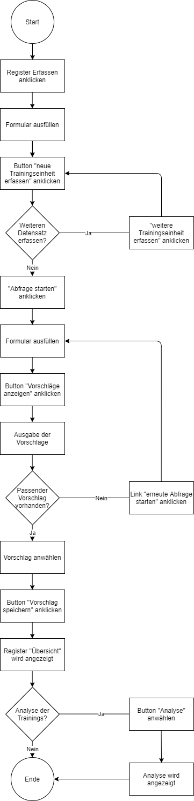

<h1>Trainingsplaner</h1>

<h2>1 Ausganslage</h2>

Aktuell plane ich die Trainings für den Turnverein spontan und kurzfristig vor dem Training.

<h2>2 Projektidee</h2>

Die Webapplikation soll mir die Planung der Trainings erleichtern, in dem ich anhand von verschiedenen Kriterien einen Vorschlag erhalte. Auf der Übersicht möchte ich sehen, was in den letzten Trainings gemacht wurde, um abwechslungsreiche Trainings zu gestalten.

<h2>3 Workflow</h2>

<h2>4 Anleitung</h2>
Damit die Applikation korrekt funktioniert, müssen folgende Module importiert werden:
 
<ul>
    <li>Flask (Flask, render_template, request, redirect, url_for</li>
    <li>Plotly</li>
</ul>
<h3>Home</h3>
<ul>
    <li>Durch das Anwählen des jeweiligen Buttons gelangt der User auf die Seiten Abfrage, Erfassen oder Übersicht</li>
</ul>

<h3>Erfassen</h3>
<ul>
    <li>Der User kann eine neue Trainingseinheit erfassen. Folgende Daten müssen eingegeben werden:</li>
        <ul>
            <li>Name (Text)</li>
            <li>Typ (Auswahl)</li>
                <ul>
                    <li>Spiel</li>
                    <li>Krafttraining</li>
                    <li>Ausdauertraining</li>
                    <li>externe Aktivität</li>
                </ul>
            <li>Ort (Auswahl)</li>
                <ul>
                    <li>Drinnen</li>
                    <li>Draussen</li>
                </ul>
            <li>Gruppengrösse (Zahl) </li>
                <ul>
                    <li>maximale Gruppengrösse</li>
                    <li>minimale Gruppengrösse</li>
                </ul>
            <li>Dauer (Zahl) </li>
                <ul>
                    <li>minimale Dauer</li>
                    <li>maximale Dauer</li>
                </ul>
        </ul>
    <li>Die Eingabe wird mit Klick auf den Button "neue Trainingseinheit erfassen" gespeichert</li>
        <ul>
            <li>Wird ein Feld leer gelassen, erscheint eine Fehlermeldung</li>
            <li>Die Felder welche eine Zahl benötigen, müssen einen Wert grösser gleich 1 haben, ansonsten erscheint eine Fehlermeldung</li>
        </ul>
</ul>

<h3>Abfrage</h3>
<ul>
    <li>Der User kann eine Abfrage starten. Folgende Daten müssen eingegeben werden:</li>
        <ul>
            <li>Datum</li>
            <li>Typ (Auswahl)</li>
                <ul>
                    <li>Spiel</li>
                    <li>Krafttraining</li>
                    <li>Ausdauertraining</li>
                    <li>externe Aktivität</li>
                </ul>
            <li>Ort (Auswahl)</li>
                <ul>
                    <li>Drinnen</li>
                    <li>Draussen</li>
                </ul>
            <li>Gruppengrösse (Zahl) </li>
            <li>Dauer (Zahl) </li>
        </ul>
    <li>Wird der Button "Vorschläge angezeigen" angewählt, werden die Angaben des Users mittels einer For-Schleife mit den Einträgen in der Datenbank verglichen</li>
        <ul>
            <li>Wird ein Feld leer gelassen, erscheint eine Fehlermeldung</li>
            <li>Die Felder welche eine Zahl benötigen, müssen einen Wert grösser gleich 1 haben, ansonsten erscheint eine Fehlermeldung</li>
        </ul>
    <li>Gibt es kein passendes Training, kann der User die Abfrage erneut starten</li>
    <li>Gibt es ein passendes Training, kann der User dieses mit anwählen und auf "Vorschlag speichern" klicken</li>
</ul>

<h3>Übersicht</h3>
<ul>
    <li>Die gespeicherten Trainings werden der Seite Übersicht ausgegeben</li>
    <ul>Die Dauer der einzelnen Traingseinheiten wird addiert und als Dauer gesamt ausgegeben</ul>
    <ul>Wird der Button "Analysieren" angewählt, öffnet sich eine neue Seite mit einer Grafik, welche die Entwicklung der Gruppengrösse zeigt</ul>
</ul>

<h2>5 Funktionen</h2>
<ul>
    <li>Dateneingabe: neue Traingseinheiten erfassen, Abfrage für Traingseinheit</li>
    <li>Datenspeicherung: Trainingseinheiten und durchgeführte Trainingseinheiten werden in JSON-Datei gespeichert</li>
    <li>Datenverarbeitung: Abfrage wird mittels For-Schleife mit der Datenbank Trainingseinheiten verglichen, Berechnung der gesamten Trainingsdauer</li>
    <li>Datenausgabe: Ausgabe der Vorschläge für Trainingseinheiten, Ausgabe der gespeicherten Trainingseinheiten, Ausgabe der Gruppengrösse und Trainingsdatum als Balken-Diagramm</li>
</ul>
